# Malta Salary Calculator

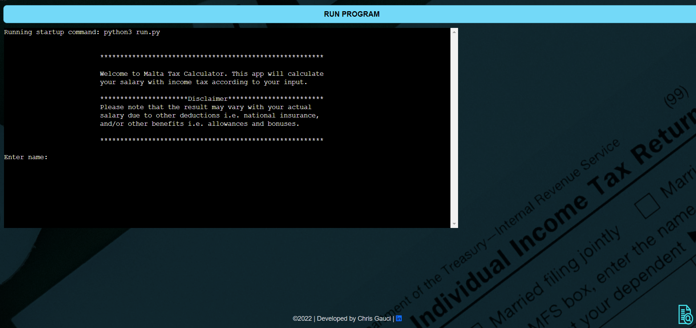

[Live application can be found here](https://taxcalc-app.herokuapp.com/)

This is a Command Line Interface application designed for a user to calculate their salary tax. 
This project has been designed for educational purposes and uses the Code Institute's mock terminal to run.

---
## UX
To begin planning this project I started first with UX, designing the logic of the app, based on the user stories. 
As this is a command-line application, there is no design features as HTML & CSS have not been used.

### Strategy
User Stories:
- As a user, I want to be able to easily access the calculator.
- As a user, I want to be able to input my name.
- As a user, I want to be able to choose from options such as Student, Age, and Marital status.
- As a user, I want to be able to input my salary gross amount to calculate net income.
- As a user, I want to be able to see Weekly Net Income, Monthly Net Income, and Yearly Net Income.
- As a user, I want to be able to see the government bonus/COLA included.
- As a user, I want to be able to have the option to re-calculate any other salary and view historic data.

### Structure
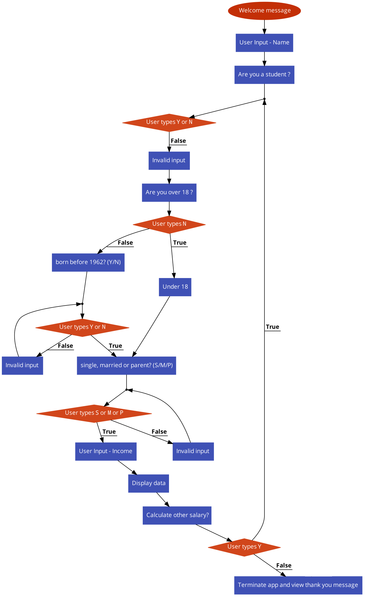

As you can see from the flowchart above the logic has been based on the six key questions;

- Are you a Student? (Y/N)	
- Are you over 18? (Y/N)
- Born before 1962? (Y/N)
- Single, Married, or Parent? (S/M/P)
- Enter your income ? (Input amount)
- Would you like to calculate another salary? (Y/N)

---
## Features
The features included in this app are the following:

### Welcome Message:
- As soon as the user runs the app, a welcome message will be printed to the terminal. 
- This message also contains a disclaimer, where it explains that the amount produced in the calculation may vary due to other deductions or benefits.

### Customized validation messages:
- To ensure a user-friendly interface, validation messages are designed on a field-by-field basis.
- Such specific messages help a user to identify what went wrong if there is an invalid input.

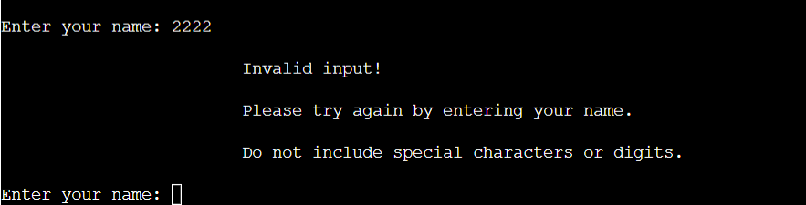
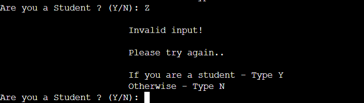
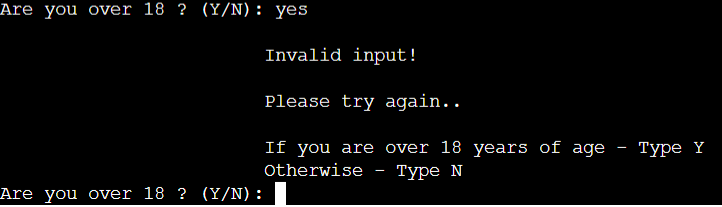
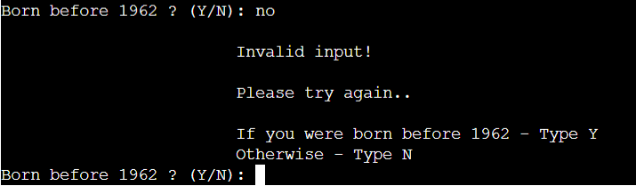
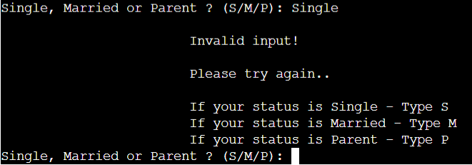
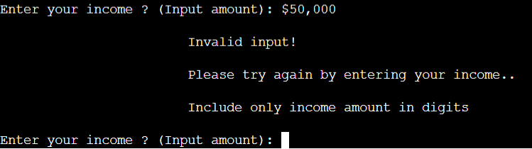

### Thank you Message:
- As the user terminates the app, a thank you message will be printed to the terminal.

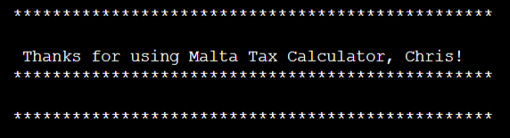

---
## Data Model
* I used Python API for Google Sheets - gspread - to store and retrieve the user's data. Every time a user calculates a salary, this information is stored in the spreadsheet.

* All these are done, on one page of the spreadsheet. If the user choose the option to calculate another salary, cumulative historical data will be displayed upon each salary calculation.

* Once the user terminates the program, any data stored will be cleared. This procedure will be also effective once the user run the program to ensure that data is clear.

    

--
## Technologies Used

I have used several technologies that have enabled this design to work:

- [Python](https://www.python.org/)
    - Python is the core programming language used to write all of the code in this application to make it fully functional.
    - In addition to core Python I have used the following Python module:
        - [Tabulate](https://pypi.org/project/tabulate/)
            - Used Tabulate to display table data beautifully.
- [GitHub](https://github.com/)
    - Used to store code for the project after being pushed.
- [Git](https://git-scm.com/)
    - Used for version control by utilizing the Gitpod terminal to commit to Git and Push to GitHub.
- [Gitpod](https://www.gitpod.io/)
    - Used as the development environment.
- [Heroku](https://dashboard.heroku.com/apps)
    - Used to deploy my application.
- [Lucid](https://lucid.app/documents#/dashboard)
    - Used to create the flowchart for the project.
- [Pep8](http://pep8online.com/)
    - Used to test my code for any issues or errors.
- [Grammarly](https://www.grammarly.com/)
    - Used to fix some grammar errors found in the project.
---
## Testing

### User Stories

*'As a user, I want to be able to easily access the calculator.'*  
The app is simplified. As soon as the app is executed - A Welcome message will be printed and at the same time, the user will be prompted to input his/her name.
Once the user inputs the name - six questions will follow. The calculation depends on user input.

*'As a user, I want to be able to input my name.'*  
This is the first input. The user is asked to input a value for First Name. 

*'As a user, I want to be able to choose from options such as Student, Age, Marital status.'*  
These options/questions determine the outcome of the displayed data. The calculation is based on the input, so the user will be prompted on each, by inputting Y/N.
This ensures that the user won't skip a question that is dependent on the outcome.

*'As a user, I want to be able to input my salary gross amount to calculate net income.'*    
This is one of the questions - once the user inputs the gross amount  of the salary in digits, the calculation can be performed and data will be displayed in a table
will be printed accordingly.

*'As a user, I want to be able to see Weekly Net Income, Monthly Net Income, and Yearly Net Income.'*  
Once the user answers all questions -  A tabular table will be printed, displaying data that includes the Gross Salary, Tax, COLA/Bonus, and Net Salary.
This data will be displayed in three columns, namely - Weekly Net Income, Monthly Net Income, and Yearly Net Income.

*'As a user, I want to be able to have the option to re-calculate any other salary.'*
This user will be prompted for the said option as soon as the table is printed. Otherwise, the user can choose to terminate the app.

### Input Validation

As this app relies heavily on users inputting information, validating these values is of the utmost importance at every step to ensure the information is viable.

The method `is_valid_input` is used to check if the input is valid; Either it is Y/N (for yes/no) OR SMP (for single/married/parent)

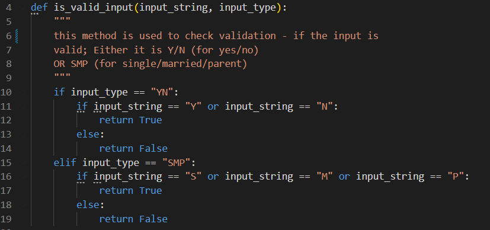
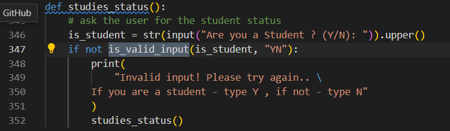

The method `validate_name` is used to scan a number and special character.
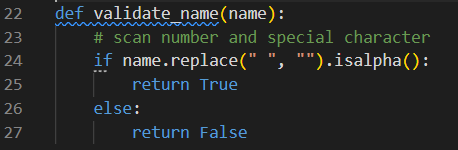
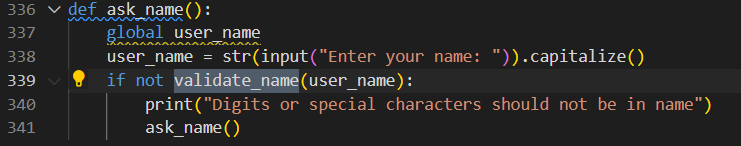

### Bugs and Fixes

I received feedback from one of my peers that the application does not start from the beginning of the user wishes to calculate another salary;
Upon consultation with Tutor, Ed Bradley, I fixed this issue by making more use of functions, ensuring that I would be able to restart/reuse code multiple times.
Breaking the app into smaller, repeatable chunks had solved the bug.

In addition to my testing of the app, I passed my code through the [Pep8](http://pep8online.com/) online validator which passed through with 0 issues:

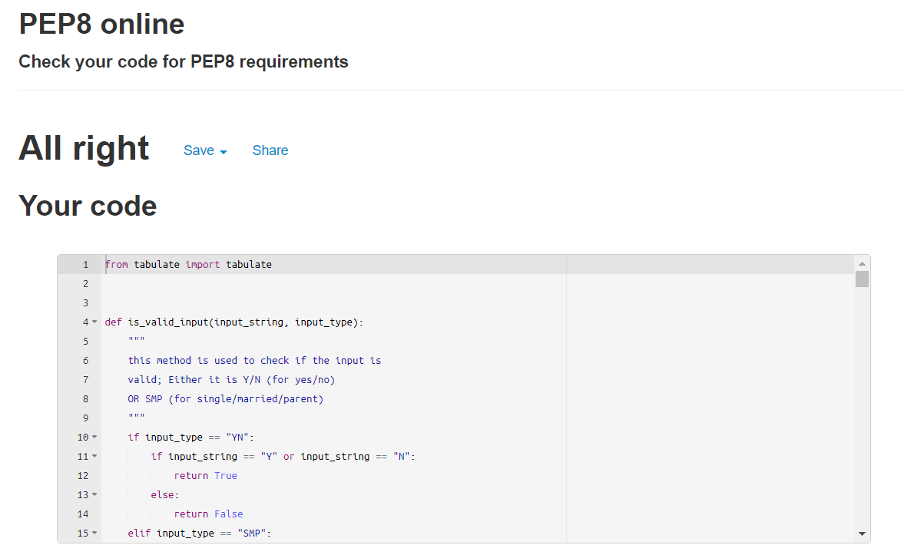

---
## Deployment

The master branch of this repository has been used for the deployed version of this application.

### Using Github & Gitpod

To deploy my command-line interface application, I had to use the [Code Institute Python Essentials Template](https://github.com/Code-Institute-Org/python-essentials-template), as this enables the application to be properly viewed on Heroku using a mock terminal. 

- Click the `Use This Template` button.
- Add a repository name and brief description.
- Click the `Create Repository from Template` to create your repository.
- To create a Gitpod workspace you then need to click `Gitpod`, this can take a few minutes.
- When you want to work on the project it is best to open the workspace from Gitpod (rather than Github) as this will open your previous workspace rather than create a new one. You should pin the workspace so that it isn't deleted.
-  Committing your work should be done often and should have clear/explanatory messages, use the following commands to make your commits:
    - `git add .`: adds all modified files to a staging area
    - `git commit -m "A message explaining your commit"`: commits all changes to a local repository.
    - `git push`: pushes all your committed changes to your Github repository.

*Forking the GitHub Repository*

If you want to make changes to your repository without affecting it, you can make a copy of it by 'Forking' it. This ensures your original repository remains unchanged.

1. Find the relevant GitHub repository
2. In the top right corner of the page, click the Fork button (under your account)
3. Your repository has now been 'Forked' and you have a copy to work on

*Cloning the GitHub Repository*

Cloning your repository will allow you to download a local version of the repository to be worked on. Cloning can also be a great way to backup your work.

1. Find the relevant GitHub repository
2. Press the arrow on the Code button
3. Copy the link that is shown in the drop-down
4. Now open Gitpod & select the directory location where you would like the clone created
5. In the terminal type 'git clone' & then paste the link you copied on GitHub
6. Press enter and your local clone will be created.

### Creating an Application with Heroku

I followed the below steps using the Code Institute tutorial:

- The following command in the Gitpod CLI will create the relevant files needed for Heroku to install your project dependencies `pip3 freeze --local > requirements.txt`. Please note this file should be added to a .gitignore file to prevent the file from being committed.

1. Go to [Heroku.com](https://dashboard.heroku.com/apps) and log in; if you do not already have an account then you will need to create one.
2. Click the `New` dropdown and select `Create New App`.
3. Enter a name for your new project, all Heroku apps need to have a unique name, and you will be prompted if you need to change it.
4. Select the region you are working in.

*Heroku Settings*
You will need to set your Environment Variables - this is a key step to ensuring your application is deployed properly.
- In the Settings tab, click on `Reveal Config Vars` and set the following variables:
    - Add key: `PORT` & value `8000`
- Buildpacks are also required for proper deployment, simply click `Add buildpack` and search for the ones that you require.
    - For this project, I needed to add `Python` and `Node.js`, in this order.

*Heroku Deployment*
In the Deploy tab:
1. Connect your Heroku account to your Github Repository following these steps:	
    1. Click on the `Deploy` tab and choose `Github-Connect to Github`.
    2. Enter the GitHub repository name and click on `Search`.
    3. Choose the correct repository for your application and click on `Connect`.
2. You can then choose to deploy the project manually or automatically, automatic deployment will generate a new application every time you push a change to Github, whereas manual deployment requires you to push the `Deploy Branch` button whenever you want a change made.
3. Once you have chosen your deployment method and have clicked `Deploy Branch` your application will be built and you should see the below `View` button, click this to open your application:

---
## Credits

All of this code has been written by me, however, I have used [Stack Overflow](https://stackoverflow.com/) to help me debug my code and fix any issues that I had.

[`PDB`](https://www.geeksforgeeks.org/debugging-python-code-using-breakpoint-and-pdb/) has been useful as well, to help me debug my code.

[Python Wiki](https://wiki.python.org/moin/WhileLoop) has been used throughout to assist me on while loops.

---
## Acknowledgements

I would like to thank my course mentor, Harry Dhillon, for his support and guidance throughout the project and my peers on Code Institute's slack channels for their support & feedback.

---
