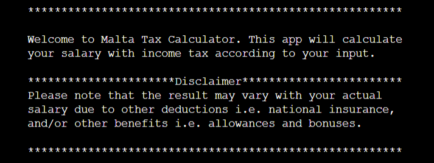
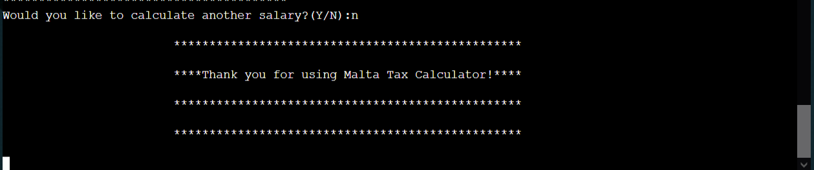

# Malta Salary Calculator

[Live application can be found here](https://.herokuapp.com/)

This is a Command Line Interface application designed for a user to calculate their salary tax. 
This project has been designed for educational purposes and uses the Code Institutes mock terminal to run.

---
## UX
To begin planning this project I started first with UX, designing the logic of the app, based on the user stories. 
As this is a command-line application there is no design featured as HTML & CSS has not been used.

### Strategy
User Stories:
- As a user, I want to be able to easily access the calculator.
- As a user, I want to be able to input my name.
- As a user, I want to be able to choose from options such as Student, Age, and Marital status.
- As a user, I want to be able to input my salary gross amount to calculate net income.
- As a user, I want to be able to see Weekly Net Income, Monthly Net Income, and Yearly Net Income.
- As a user, I want to be able to see the government bonus/COLA included.
- As a user, I want to be able to have the option to re-calculate any other salary.

### Structure

As you can see from the flowchart above the logic has been based on the six key questions;

- Are you a Student? (Y/N)	
- Are you over 18? (Y/N)
- Born before 1962? (Y/N)
- Single, Married, or Parent? (S/M/P)
- Enter your income ? (Input amount)
- Would you like to calculate another salary? (Y/N)

---
## Features
The features included in this app are the following:

### Welcome Message:
- As soon as the user runs the app, a welcome message will be printed to the terminal. 
- This message also contains a disclaimer, where it explains that the amount produced in the calculation may vary due to other deductions or benefits.

### Thank you Message:
- As the user terminates the app, a thank you message will be printed to the terminal.

---
## Technologies Used

I have used several technologies that have enabled this design to work:

- [Python](https://www.python.org/)
    - Python is the core programming language used to write all of the code in this application to make it fully functional.
    - In addition to core Python I have used the following Python module:
        - [tabulate](https://pypi.org/project/tabulate/)
            - Used tabulate to display table data beautifully.
- [GitHub](https://github.com/)
    - Used to store code for the project after being pushed.
- [Git](https://git-scm.com/)
    - Used for version control by utilizing the Gitpod terminal to commit to Git and Push to GitHub.
- [Gitpod](https://www.gitpod.io/)
    - Used as the development environment.
- [Heroku](https://dashboard.heroku.com/apps)
    - Used to deploy my application.
- [Lucid](https://lucid.app/documents#/dashboard)
    - Used to create the flowchart for the project.
- [Pep8](http://pep8online.com/)
    - Used to test my code for any issues or errors.
- [Grammarly](https://www.grammarly.com/)
    - Used to fix some grammar errors found in the project.
---
## Testing

### User Stories

*'As a user, I want to be able to easily access the calculator.'*  
The app is simplified. As soon as the app is executed - A Welcome message will be printed and at the same time, the user will be prompted to input his/her name.
Once the user inputs the name - six questions will follow. The calculation depends on user input.

*'As a user, I want to be able to input my name.'*  
This is the first input. The user is asked to input a value for First Name. 

*'As a user, I want to be able to choose from options such as Student, Age, Marital status.'*  
These options/questions determine the outcome of the displayed data. The calculation is based on the input, so the user will be prompted on each, by inputting Y/N.
This ensures that the user won't skip a question that is dependent on the outcome.

*'As a user, I want to be able to input my salary gross amount to calculate net income.'*    
This is one of the questions - once the user inputs the gross amount  of the salary in digits, the calculation can be performed and data will be displayed in a table
will be printed accordingly.

*'As a user, I want to be able to see Weekly Net Income, Monthly Net Income, and Yearly Net Income.'*  
Once the user answers all questions -  A tabular table will be printed, displaying data that includes the Gross Salary, Tax, COLA/Bonus, and Net Salary.
This data will be displayed in three columns, namely - Weekly Net Income, Monthly Net Income, and Yearly Net Income.

*'As a user, I want to be able to have the option to re-calculate any other salary.'*
This user will be prompted for the said option as soon as the table is printed. Otherwise, the user can choose to terminate the app.

### Input Validation

As this app relies heavily on users inputting information, validating these values is of the utmost importance at every step to ensure the information is viable.

The method `is_valid_input` is used to check if the input is valid; Either it is Y/N (for yes/no) OR SMP (for single/married/parent)

The method `validate_name` is used to scan a number and special character.

